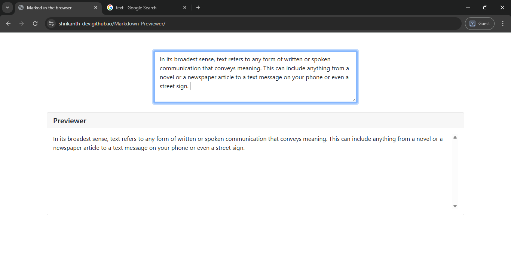

# Markdown Previewer

## Table of Contents

- [Overview](#overview)
  - [The Challenge](#the-challenge)
  - [Screenshot](#screenshot)
  - [Links](#links)
  - [Built With](#built-with)

## Overview

A clean, responsive Markdown Previewer built using:

- Bootstrap for layout and styling  
- Marked.js for parsing markdown to HTML in real-time  
- Simple textarea input and scrollable preview box

### The Challenge

- Build a markdown previewer using vanilla JS and Marked.js.
- Ensure responsive, clean styling with Bootstrap.
- Allow users to type markdown and instantly see the preview.

### Screenshot

### Links

- [Live Site URL](https://shrikanth-dev.github.io/Markdown-Previewer/)
- [solution URL](https://github.com/shrikanth-dev/Markdown-Previewer)

### Built With

- HTML5
- CSS (Bootstrap 5)
- JavaScript
- Marked.js

